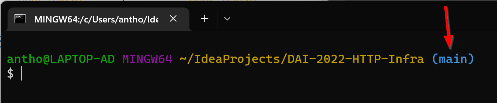
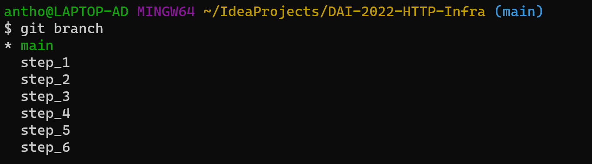
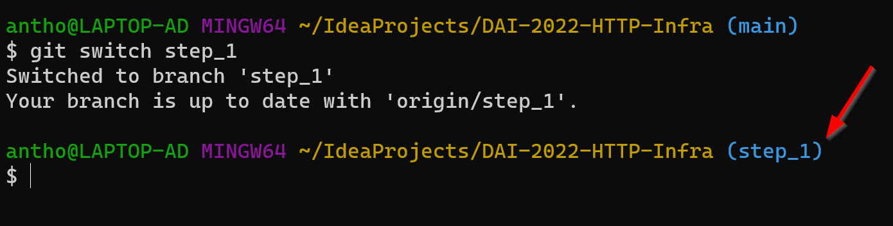
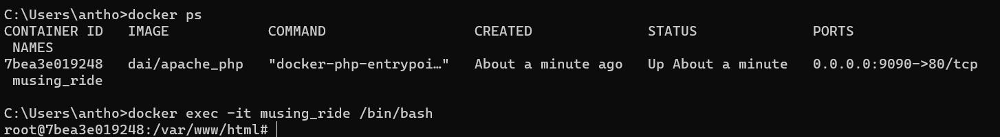
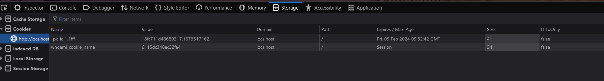

# Rapport laboratoire 4 - SMTP
Auteurs : Anthony David, Stéphane Nascimento Santos

Date : 19.01.2022

# Table des matière

[TOC]

# 1. Introduction
Dans ce laboratoire, nous allons nous familiariser avec les outils logiciels qui nous permettront de construire une infrastructure web complète. Nous allons configurer un serveur Web et un reverse-proxy pour servir du contenu statique et dynamique aux navigateurs web. 

Nous utiliserons également le framework JavaScript express.js pour écrire facilement des applications Web dynamiques. Le deuxième objectif sera de mettre en œuvre une application Web dynamique simple, en créant des ressources HTML, CSS et JavaScript pour les navigateurs. 

Le troisième objectif sera de mettre en pratique l'utilisation de Docker, en empaquetant tous les composants de l'infrastructure web dans des images Docker personnalisées et en utilisant Docker Compose pour définir une infrastructure complète avec plusieurs composants.

# 2. Infrastructure du projet

L'entier du projet se trouve sur le dépôt GitHub suivant :
https://github.com/HEIGVD-Course-DAI/DAI-2022-HTTP-Infra

Le projet se décompose en plusieurs étapes distinctes :
1. Serveur HTTP statique avec Apache httpd
2. Serveur HTTP dynamique avec Express.js
3. Gestion d'un cluster dynamique
4. Requête AJAX avec JQuery
5. Equilibrage de charge : round-robin et stick sessions
6. Interface graphique de gestion

Chacun des étapes a été faite dans une branche du dépôt nommé `step_i` ou `i` est le numéro d'étape. la branch main principal du dépôt Github ne contient rien mis à part la documentation du projet. 

## 2.1 Documentation
L'entier de la documentation de ce projet se trouve dans ce rapport. A noter que ce dernier est le même, quelque soit la branche du projet sur laquelle on se trouve.

## 2.2 Procédure de déploiement

### 2.2.1 Clonage du projet sur sa machine locale
Afin de pouvoir travailler sur le projet, il est nécéssaire de le cloner sur la machine souhaitée avec la commande :
<p style="background-color: black;color: white; font-family: Courier New">
    $ git clone https://github.com/HEIGVD-Course-DAI/DAI-2022-HTTP-Infra
</p>

Par défaut la branch active en local sera la branche `main` ce que l'on peut facilement s'assurer en ouvrant le dossier en ligne de commande :
<p align="center">
     
</p> 
Celle-ci ne contient que la documentation. Implémentation est contenue dans les différents branches correspondant au étapes du cahier des charges.

### 2.2.1 Changement de branche

Comme indiqué précédemment, il est nécéssaire de changer de branche afin d'avoir accès aux différentes étapes du projet. Les commandes suivantes les permette :
- Affichage des branches du dépôt local :
<p style="background-color: black;color: white; font-family: Courier New">
    $ git branch
</p>
<p align="center">
     
</p> 
- Changement de branche
<p style="background-color: black;color: white; font-family: Courier New">
    $ switch nom_branch
</p>
<p align="center">
     
</p> 

# 3. Implémentation
Cette section présente comment le projet a été implémenté et quel sont les choix que nous avons fait.

## 3.1 Etape 1 - Serveur HTTP statique avec Apache httpd
Il nous étais demandé de mettre en place un serveur statique HTTP et de la faire fonctionner dans un container Docker en utilisant httpd.

En se basant sur un template Bootstrap trouvé sur internet, nous avons développé un site internet présentant ce laboratoire et les membres du groupe.

<p align="center">
     
</p>

Toute la configuration de ce site web statique se trouve dans le dossier `DAI-2022-HTTP-Infra/docker-images/apache-php-image` et contient les éléments suivants :
- fichier `Dockerfile` qui contient les instructions permettant d'installer et de configurer notre container
- dossier `content` contenant les fichiers source du site web statique
- fichier `build-image.sh` qui est le scripte de création de l'image Docker
- fichier `run-container.sh` qui est le scripte permettant de lancer le conteneur Docker.

Les différents fichiers et dossiers sont présentés plus spécifiquement ci-dessous.

La procédure de déploiement du container se trouve au point [Point 4.1](#4.1-Etape-1---Serveur-HTTP-statique-avec-Apache-httpd) de ce présent document.

### 3.1.1 Fichier Dockerfile
Afin d'héberger notre site internet statique sur un container Docker, nous avons décidé d'utiliser l'image PHP 7.2 et son implémentation avec serveur Apache que nous importons dans le `Dockerfile` comme suit :
```
FROM php:7.2-apache
COPY src/ /var/www/html/
```
La seconde ligne indique que ce serveur Apache doit charger le contenu du dossier src se trouvant.

### 3.1.2 Dossier content
Le dossier contient les différents fichiers de notre site web statique(html, css et javascript). Les site proposé a été fait avec un template BootStrap trouvé sur internet.

### 3.1.3 scriptes de création et de lancement du container
Pour créer l'image avec notre site web, il suffit de lancer le scripte `build-image.sh` :

Celui-ci contient simplement la ligne de commande permettant de créer l'image sous le nom de dai/apache_php :
`docker build -t dai/apache_php .`

Pour lancer le container il suffit de lancer le scripte `run-container.sh` :

Celui-ci contient la ligne de commande permettant de lancer le container avec l'image se nommant dai/apache_php :
`docker run -d -p 9090:80 dai/apache_php`

Ce qui va permettre de lancer le serveur avec un mapping du port 80 exposé à l'intérieur du conteneur Docker vers le port 9090 de notre hôte.

### 3.1.4 Connexion sur le serveur web dans le container
A noter qu'il est possible de se connecter sur le serveur afin de pouvoir accéder à son système de fichier en faire des modifications à chaud.
Pour se faire, il faut ajouter le paramètre -it avec l'indication qu'on veut se connecter au bash lors du démarrage du container :

Il faut récuper le nom du container avec la commande :

<p style="background-color: black;color: white; font-family: Courier New">
    $ docker ps
</p>

Et lancer la commande avec le nom du container :
<p style="background-color: black;color: white; font-family: Courier New">
    $ docker exec -it mon_container /bin/bash
</p>

Exemple :
<p align="center">
     
</p>


## 3.2 Etape 2 - Serveur HTTP dynamique avec Express.js
Le contenu de l'étape 2 est très similaire à celui de l'étape 1. 

Toute la configuration de ce site web statique se trouve dans le dossier `DAI-2022-HTTP-Infra/docker-images/express-image` et contient les éléments suivants :
- fichier `Dockerfile` qui contient les instructions permettant d'installer et de configurer notre container
- dossier `src` contenant les fichiers source du site web statique
- fichier `build-image.sh` qui est le scripte de création de l'image Docker
- fichier `run-container.sh` qui est le scripte permettant de lancer le conteneur Docker.

Les différents fichiers et dossiers sont présentés plus spécifiquement ci-dessous.

La procédure de déploiement du container se trouve au point [Point 4.2](#4.2-Etape-2---Serveur-HTTP-dynamique-avec-Express.js) de ce présent document.

### 3.2.1 fichier Dockerfile
Le contenu du Dockerfile est le suivant :
```
FROM node:18.12.1
COPY src /opt/app
CMD ["node", "opt/app/index.js]
```

Cela indique que nous allons utiliser l'image fournie sur Docker Hud de Node version 18.12.1 et qu'on demande qu'il copie le contenu de notre dossier src dans le dossier /opt/app de notre serveur node.
La dernière ligne est un scripe permettant d'envoyer les commandes nécéssaires à notre serveur.

### 3.2.2 Dossier src
Tout comme pour le serveur statique, il contient nos fichier qui seront copiés sur le serveur. Mais cette fois-ci, au lieu d'avoir un site web statique avec un fichier principal `index.html` on aura une application javcascript avec comme fichier principal `index.js`.

Dans l'état actuel, l'application retourne des tableaux de 0 à 10 adresses fictives :
- prénom
- nom
- adresse (rue et no)
- code postal
- ville

### 3.2.3 Scriptes de création d'image et de lancement de notre container
Même fonctionnement que pour le site statique.

## 3.3 Etape 3 - Gestion d'un cluster dynamique
Afin de mettre en place une gestion dynamique des clusters, nous avons mis en place Docker Compose.

Dans le cas où Docker Desktop est installé sur la machine hôte, Docker Compose est déjà installé. Autrement il peut l'être en suivant les étapes de la procédures suivante : [https://docs.docker.com/compose/](https://docs.docker.com/compose/).

### 3.3.1 Docker compose et fichier docker-compose.yml
Afin de pouvoir démarrer une instance Docker Compose, il faut qu'un fichier `docker-compose.yml` soit mis en place à la racine du projet. Celui contient le nécéssaire à démarrer plusieurs containers soit :
- notre serveur statique basé sur Apache
- notre serveur dynamique basé sur Node.js
- un container avec une instance de Traefik qui va nous permettre de gérer le reverse-proxy.

### 3.3.2 Création ou mise à jour des images
Un scripte permettant de créer les deux images des nos serveurs ou de l'écraser par une version actuelle  a été crée et se nomme `build-images.sh`. Ceci, afin d'éviter de devoir aller créer les deux images l'une après l'autre dans chancun des dossiers respectif `apache-php-image` et `express-image`.

### 3.3.3 Nombre de containers 
Par défaut, il lance 3 instances de chacun des container. Pour augmenter ou diminuer le nombre d'instance il faut modifier le champ `replica` dans le fichier `docker-compose.yml`.

## 3.4 Etape 4 - Requête AJAX avec JQuery
Les modifications ont été faites uniquement au niveau du serveur statique.

Un scripte Javascript a été ajouté dans le dossier `DAI-2022-HTTP-Infra\docker-images\apache-php-image\content\js` nommé `persons.js` et qui va remplacer les balises avec l'id "persons" dans le fichier.

Dans le fichier `index.html` le scripte a été ajouté et un id "persons" a été également ajouté au bloc de texte qu'on veut remplacer par le résultat des requêtes AJAX.

A noter que pour cette étape nous avons par défaut qu'une instance de chaque type de container qui démarrer conformément à ce que nous avons configuré dans sur Docker Compose.

## 3.5 Etape 5 - Equilibrage de charge : round-robin et stick sessions
Pour activer la gestion de sessions Sticky-Sessions pour le serveur statique, les modifications ont été faites dans le fichier `docker-compose.yml`. On active le sticky-sessions et on crée un cookie qui sera stocké sur l'ordinateur de l'utilisateur :
```
labels :
    - traefik.http.services.whoami-service.loadBalancer.sticky.cookie=true
    - traefik.http.services.whoami-service.loadBalancer.sticky.cookie.name=whoami_cookie_name
```

On peut remarquer le bon fonctionnemement en allant vérifier le cookie sur le navigateur :
<p align="center">
     
</p> 

Si on supprimer le coookie et que l'on ferme la session, alors un nouveau seré créé et un nouveau serveur pourrais nous être affecté.

## 3.6 Etape 6 - Interface graphique de gestion 
Nous avons utilisé une solution existante nommée [Portainer](hhttps://docs.docker.com/compose/).

Celui-ci offire sur une interface graphique bon nombre de fonctionnalités pour la gestion de nos containers :
- arrêt et démarrage de conteneurs
- gestion des grapes de conteneurs avec Docker Compose
- gestion de templates
- gestion des images, des volumes, des réseaux, etc..

Pour le mettre en place, nous avons simplement suivi le procédure dans la documentation et ajouté le servide dane le fichir ``docker-compose.yml`.

# 4. Procédure de déploiement
Cette section présente une brève procédure par étape du projet afin de pouvoir facilement déployer la solution sans connaissance préalable de l'implémentation du projet.

## 4.1 Etape 1 - Serveur HTTP statique avec Apache httpd
1. Se rendre dans le dossier `DAI-2022-HTTP-Infra/docker-images/apache-php-image`.
2. Modifier à souhait le site web statique dans le dossier `content`.
3. Lancer le création de l'image via le scripte :
<p style="background-color: black;color: white; font-family: Courier New">
    $ ./build-image.sh
</p>

4. Lancer le container via le scripte :
<p style="background-color: black;color: white; font-family: Courier New">
    $ ./run-container.sh
</p>

5. Accéder au site web à l'adresse `localhost:9090`

## 4.2 Etape 2 - Serveur HTTP dynamique avec Express.js

1. Se rendre dans le dossier `DAI-2022-HTTP-Infra/docker-images/apache-php-image`.
2. Modifier à souhait l'application web dans le dossier `src`.
3. Lancer le création de l'image via le scripte :
<p style="background-color: black;color: white; font-family: Courier New">
    $ ./build-image.sh
</p>

4. Lancer le container via le scripte :
<p style="background-color: black;color: white; font-family: Courier New">
    $ ./run-container.sh
</p>

5. Accéder au site web à l'adresse `localhost:9091`

## 4.3 Etape 3 - Gestion d'un cluster dynamique
1. Se rendre dans le dossier `DAI-2022-HTTP-Infra/docker-images`
2. Si les images `express-persons` et `apache_php` ne sont pas existante, lancer le scripte de création :
<p style="background-color: black;color: white; font-family: Courier New">
    $ ./build-images.sh
</p>

3. Lancer le Docker Compose avec la commande (`-d` pour lancer en arrière-plan):
<p style="background-color: black;color: white; font-family: Courier New">
    $ docker compose up -d
</p>

4. Le site web est disponible à l'adresse `localhost` pour le site statique et à `localhost/api` pour l'application dynamique.
5. Pour arrêter le Docker Compsoe, faire la commande :
<p style="background-color: black;color: white; font-family: Courier New">
    $ ./docker compose stop
</p>

## 4.4 Etape 4 - Requête AJAX avec JQuery
Il suffit de lancer le Docker Compose de manière similaire à l'étape [Point 4.3](#4.3-Etape-3---Gestion-d'un-cluster-dynamique).

## 4.5 Etape 5 - Equilibrage de charge : round-robin et stick sessions
Il suffit de lancer le Docker Compose de manière similaire à l'étape [Point 4.3](#4.3-Etape-3---Gestion-d'un-cluster-dynamique).

## 4.6 Etape 6 - Interface graphique de gestion 
Pour démarrer les conteneurs, même procédure que pour les points [4.3 à 4.5](#4.3-Etape-3---Gestion-d'un-cluster-dynamique).

Pour se connecter sur Portainer:
1. se rendre à l'adresse `localhost:9000`.
2. se connecter avec les identifiants paramétré :
- username : `admin`
- password : `mot-de-passe`

# 5. Conclusion
Après avoir effectué ce laboratoire, nous nous sommes familiarisé avec des outils logiciels qui nous permettent de construire une infrastructure HTTP complète. Nous avons put mettre en pratique des concepts très théorique vus dans le cadre du cours DAI.

De plus, il a été fort appréciable de travailler avec Docker et de continuer d'améliorer notre connaissance de cet outil.


