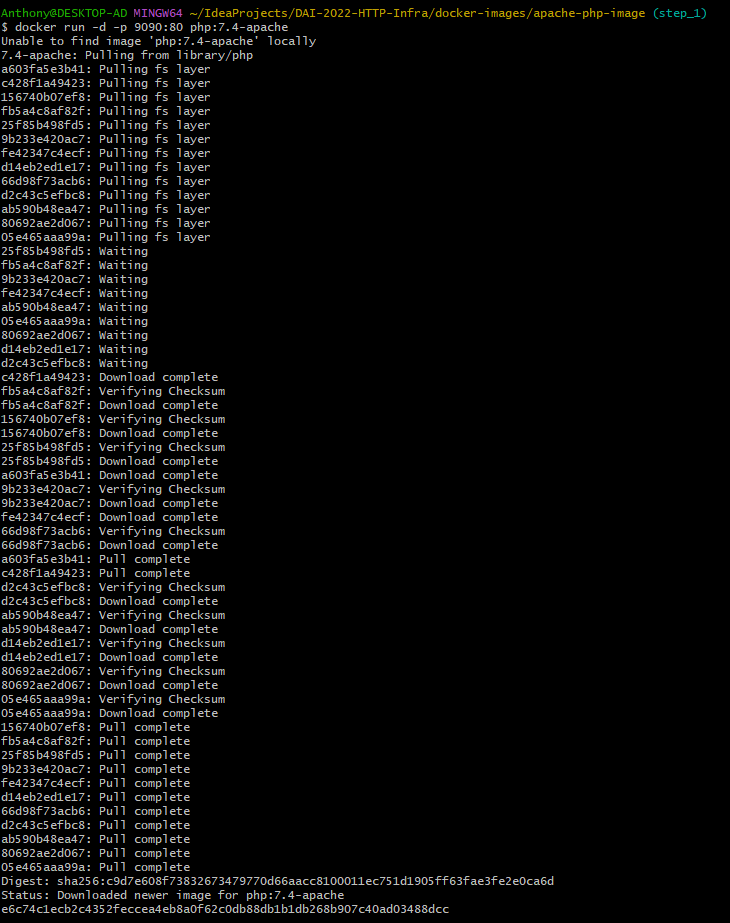
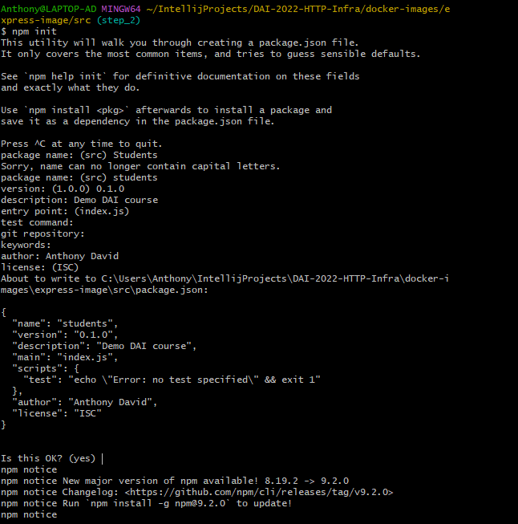

# Rapport laboratoire 4 - SMTP
Auteurs : Anthony David, Stéphane Nascimento Santos
Date : 08.12.2022

# Table des matières
TODO : compléter la table des matières

# 1. Introduction


# 2. Suivi du projet
## 2.1 Etape 1
### 2.1.1 Choix de l'image docker à utiliser
Comme vu dans la vidéo, on peut utiliser soit l'image officielle Apache, soit cellee PHP présente sur le DockerHub.
Nous avons décidé de travailler avec l'image PHP.

Pour se faire, il faut copier ceci dans le fichier DockerFile :
```
FROM php:7.2-apache
COPY src/ /var/www/html/
```

Lancement du serveur docker :

`$ docker run -d -p 9090:80 php:7.4-apache`

La première fois Il va devoir télécharger le contenu de l'image Docker :

<p align="center">
     
</p> 


 Il va lancer un container avec notre serveur Apache avec le port `9090` en http pour pouvoir se connecter sur le site web via un navigateur internet et il fera les requête sur le port `80`.

 ### 2.1.2 Création de l'image Docker
La commande pour créer l'image Docker et la suivante :
`docker build -t [image-name] .`

Afin de facilier l'utilisation, nous avons créé un scripte `build-image` qui va créé l'image en la nommant "dai/apache_php".

## 2.2 Etape 2
### 2.2.1 Configuration
1) 
Docker file avec le contenue suivant :
```
FROM node:18.11.1

COPY src /opt/app

CMD ["node", "opt/app/index.js"]
```
Ce qui veut dire qu'on va vouloir utiliser la version 18.11.1 de Node (dernière version stable), qu'on va copier le contenu de src dans /opt/app du container et qu'au démarrage au veut effecteur les deux commande entre [] via un CMD.

2) 
On créé le fichier source et pour créer le contenu de ce dernier on le fait via `npm init`. On a paramétrer comme suit :
<p align="center">
     
</p> 


